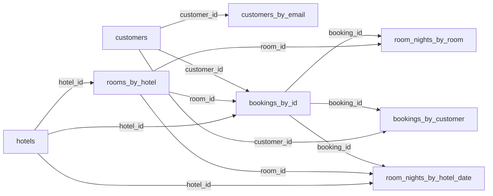

# Thiết kế dữ liệu Cassandra — Quản lý đặt phòng khách sạn

## 1. Nguyên tắc thiết kế

- Cassandra **không có JOIN và không có FOREIGN KEY**. Không thiết kế bảng trước rồi mới nghĩ query như SQL, mà làm ngược lại: **liệt kê query trước, mỗi query một bảng** (dữ liệu được lặp lại ở nhiều bảng — denormalize).
- **Partition key** quyết định dữ liệu nằm ở đâu, query phải chỉ rõ đủ partition key. **Clustering key** quyết định thứ tự các dòng trong partition và làm cho dòng là duy nhất.
- **"Khóa liên kết"** ở đây chỉ là *cùng một id được lưu ở nhiều bảng* (`hotel_id`, `room_id`, `customer_id`, `booking_id`). Không có gì tự kiểm tra tính đúng đắn, nên ứng dụng phải tự giữ bằng: kiểm tra tồn tại trước khi ghi, LWT (`IF NOT EXISTS` / `IF ...`) cho chỗ cần độc quyền, và logged batch cho các bảng phải ghi cùng nhau.

## 2. Vấn đề của thiết kế cũ

Lỗi 1–3 suy ra từ ngữ nghĩa khóa chính và upsert của Cassandra, đã tái hiện bằng cách chạy code cũ trên bộ mô phỏng trong bộ nhớ. Lỗi 6 kiểm tra trực tiếp trong driver `cassandra-driver 3.30.1`.

| # | Vấn đề | Hậu quả |
|---|--------|---------|
| 1 | `bookings_by_room` có PK `(room_id, check_in_date)` và dùng `IF NOT EXISTS`, nên chỉ chặn được hai booking **cùng ngày check-in** | Đặt 05→08 rồi 06→09 cho cùng phòng đều thành công (trùng lịch) |
| 2 | `cancel_booking` chạy `UPDATE bookings_by_customer ... WHERE booking_date = datetime.now()`. `UPDATE` trong Cassandra là upsert, mà `now()` không phải giờ lúc đặt | Sinh ra một dòng ma chỉ có `status = CANCELLED`, còn booking thật vẫn `CONFIRMED` |
| 3 | `customers_by_email` ghi bằng `INSERT` thường | Đăng ký trùng email thì ghi đè im lặng, login trỏ sang người khác |
| 4 | `bookings_by_date` thiếu `check_out_date` và giá, chỉ trả lời được "ai check-in ngày X" chứ không trả lời được "đêm X phòng nào có khách" | Dashboard phải quét từng phòng rồi từng booking (N+1 query): `revenue_by_day` gọi `get_bookings_by_room` cho mỗi booking |
| 5 | Doanh thu lấy giá từ `rooms_by_hotel` hiện tại | Đổi giá phòng thì doanh thu quá khứ đổi theo |
| 6 | Driver trả cột `date` là `cassandra.util.Date`, không phải `datetime.date`. `Date <= date` báo `TypeError` | `room_occupancy_on_date` và các hàm tính ngày trong dashboard cũ lỗi khi gặp booking thật |
| 7 | Ghi 3 bảng booking bằng 3 lần `execute` rời nhau | Lỗi giữa chừng thì các bảng lệch nhau |
| 8 | `seed_data.cql` chỉ nạp `bookings_by_room` | `bookings_by_customer` và `bookings_by_date` trống, doanh thu dashboard = 0 với dữ liệu mẫu |
| 9 | Schema viết hai nơi (`cassandra_config.py` và `seed_data.cql`) và chạy `CREATE TABLE` mỗi lần tạo repository | Hai bản dễ lệch nhau; DDL lặp lại trong đường chạy của ứng dụng |
| 10 | `created_at` dùng `datetime.now()` (giờ local), driver hiểu datetime không có múi giờ là UTC | Thời gian lưu lệch 7 tiếng so với giờ Việt Nam |

Ngoài ra `bookings_by_customer` dùng `booking_date timestamp` làm clustering key: hai booking cùng mili giây của một khách sẽ đè nhau, và cột này trùng tên nhưng khác nghĩa với `bookings_by_date.booking_date` (thực chất là ngày check-in).

## 3. Query cần phục vụ → bảng

| # | Query | Bảng | Điều kiện |
|---|-------|------|-----------|
| Q1 | Chi tiết khách sạn | `hotels` | `hotel_id` |
| Q2 | Danh sách phòng của khách sạn | `rooms_by_hotel` | `hotel_id` |
| Q3 | Chi tiết khách hàng | `customers` | `customer_id` |
| Q4 | Đăng nhập / kiểm tra email đã dùng chưa | `customers_by_email` | `email` |
| Q5 | Đặt phòng (chống trùng lịch theo khoảng ngày) | `room_nights_by_room` | `room_id`, các `stay_date` |
| Q6 | Chi tiết một booking | `bookings_by_id` | `booking_id` |
| Q7 | Lịch sử booking của khách (mới nhất trước) | `bookings_by_customer` | `customer_id` |
| Q8 | Lịch một phòng | `room_nights_by_room` | `room_id` (có thể lọc khoảng `stay_date`) |
| Q9 | Tìm phòng trống trong khoảng ngày | `room_nights_by_hotel_date` + `rooms_by_hotel` | `(hotel_id, stay_date)` cho từng đêm |
| Q10 | Danh sách khách check-in trong ngày | `room_nights_by_hotel_date` | `(hotel_id, stay_date)`, lọc `check_in_date = stay_date` |
| Q11 | Tình trạng phòng của một ngày | `room_nights_by_hotel_date` | `(hotel_id, stay_date)` |
| Q12 | Tỉ lệ lấp đầy theo tháng | `room_nights_by_hotel_date` | mỗi ngày một partition |
| Q13 | Doanh thu theo ngày / tháng | `room_nights_by_hotel_date` | mỗi ngày một partition, cộng `price_per_night` |
| Q14 | Hủy booking | `bookings_by_id` → các bảng còn lại | `booking_id` |

## 4. Schema mới

Định nghĩa đầy đủ nằm trong [`schema.cql`](../schema.cql) (nguồn duy nhất).

| Bảng | Partition key | Clustering key | Vai trò |
|------|---------------|----------------|---------|
| `hotels` | `hotel_id` | — | Danh mục khách sạn |
| `rooms_by_hotel` | `hotel_id` | `room_id` | Phòng của một khách sạn |
| `customers` | `customer_id` | — | Hồ sơ khách |
| `customers_by_email` | `email` | — | Đăng nhập và **ràng buộc email duy nhất** |
| `bookings_by_id` | `booking_id` (timeuuid) | — | Nguồn sự thật của booking, có `nights`, giá chốt, `total_amount` |
| `bookings_by_customer` | `customer_id` | `booking_id` DESC | Lịch sử booking của khách |
| `room_nights_by_room` | `room_id` | `stay_date` | Mỗi đêm của mỗi phòng là 1 dòng, **bảng chống trùng lịch** |
| `room_nights_by_hotel_date` | `(hotel_id, stay_date)` | `room_id` | Đêm X của khách sạn Y phòng nào có khách, phục vụ dashboard và tìm phòng trống |

Vài lựa chọn đáng chú ý:

- **Mỗi đêm một dòng.** Đặt phòng 10→13 nghĩa là khóa 3 đêm 10, 11, 12. Hai booking trùng nhau khi và chỉ khi chung ít nhất một đêm, nên chỉ cần `INSERT ... IF NOT EXISTS` cho từng đêm là bắt được mọi kiểu chồng lịch (gác đầu, gác cuối, nằm trong, bao trùm). Ngày trả phòng không tính là đêm ở, nên trả phòng ngày 13 và nhận phòng ngày 13 là hợp lệ.
- **`booking_id` là timeuuid**: vừa duy nhất, vừa chứa thời điểm đặt. Dùng làm clustering key của `bookings_by_customer` với `DESC` là có luôn "mới nhất trước", không cần cột `booking_date`.
- **Partition của `room_nights_by_hotel_date` là (khách sạn, ngày)**: tối đa bằng số phòng của khách sạn nên không bao giờ phình. Xem tình trạng một ngày = đọc đúng 1 partition, cả tháng = 28–31 partition.
- **Giá chốt lúc đặt** (`price_per_night`) được lưu cùng booking và từng đêm, đổi giá phòng sau này không ảnh hưởng doanh thu cũ.
- **Không chia `room_nights_by_room` theo năm.** Conditional batch bắt buộc mọi dòng cùng một partition, chia theo năm sẽ làm hỏng booking gác qua Tết. Mỗi phòng chỉ có ~365 dòng mỗi năm nên partition vẫn rất nhỏ.

## 5. Sơ đồ khóa liên kết



Mũi tên nghĩa là "id này được lưu lại ở bảng đích". Không có ràng buộc nào ở tầng DB, `BookingRepository.create_booking` kiểm tra phòng và khách có tồn tại trước khi ghi.

## 6. Luồng ghi và thứ tự

**Đặt phòng** (`create_booking`)

1. Kiểm tra `check_out > check_in`, tối đa 30 đêm, phòng tồn tại và không bảo trì, khách tồn tại.
2. **Khóa các đêm**: một conditional batch `INSERT ... IF NOT EXISTS` vào `room_nights_by_room` (cùng partition `room_id` nên được phép). Một đêm đã có người giữ thì cả batch không được áp dụng, không để lại gì.
3. **Ghi các bảng đọc** trong một logged batch: `bookings_by_id`, `bookings_by_customer`, các dòng `room_nights_by_hotel_date`. Nếu bước này lỗi, code tự nhả các đêm vừa khóa.

**Hủy phòng** (`cancel_booking`, chỉ cần `booking_id`)

1. `UPDATE bookings_by_id ... IF status = 'CONFIRMED'`: chỉ một lần hủy thành công, hủy lần hai bị từ chối.
2. Logged batch: đổi `status` ở `bookings_by_customer`, xóa các dòng `room_nights_by_hotel_date`.
3. **Cuối cùng mới nhả khóa** ở `room_nights_by_room` bằng `DELETE ... IF booking_id = ?` (chỉ xóa đêm đúng là của booking này).

Thứ tự trên được chọn để nếu chết giữa chừng thì sai lệch luôn theo hướng an toàn: phòng có thể bị giữ dư (không ai đặt được cho tới khi dọn), **không bao giờ bị đặt trùng**. LWT dùng nhất quán cho các dòng khóa: không trộn ghi thường và LWT trên cùng một dữ liệu.

## 7. Tương thích với code hiện có

Tên hàm và chữ ký của các repository được giữ nguyên để phần của các bạn khác không vỡ. Chỗ có khác:

| Hàm | Thay đổi |
|-----|----------|
| `CustomerRepository.create` | Raise `ValueError` nếu email đã đăng ký (bản cũ ghi đè im lặng). Email được chuẩn hóa `strip().lower()` |
| `BookingRepository.create_booking` | Thêm tham số tùy chọn `booking_id` (dùng cho seed). Trả về vẫn là `(success, booking_id, message)` |
| `BookingRepository.cancel_booking` | Chỉ cần `booking_id`; các tham số cũ vẫn nhận nhưng không dùng nữa |
| `BookingRepository.get_bookings_by_customer` | Mỗi dòng có thêm `check_in_date`, `check_out_date`, `total_amount`, `room_number`; `booking_date` suy ra từ timeuuid |
| `BookingRepository.get_bookings_by_room` | Chỉ trả các booking đang giữ phòng (CONFIRMED) |
| `BookingRepository.get_bookings_by_date` | Vẫn là "khách check-in ngày X của khách sạn Y" |
| Hàm mới | `get_booking`, `get_stays_on_date`, `find_available_rooms` |
| `DashboardService` | Doanh thu tính **theo đêm lưu trú** (đêm nào tính vào ngày đó) thay vì gộp cả booking vào ngày check-in; booking gác hai tháng sẽ chia đúng cho từng tháng. `revenue_by_day` có thêm khóa `occupied_rooms` |
| `rooms_by_hotel.status` | Chỉ nên hiểu là tình trạng vật lý (`AVAILABLE`, `MAINTENANCE`); phòng có khách hay không được suy ra từ booking |

## 8. Chuyển từ DB cũ sang

Khóa chính của bảng Cassandra không sửa được, và `CREATE TABLE IF NOT EXISTS` sẽ âm thầm bỏ qua bảng cũ nên phải tạo lại:

```powershell
python seed_db.py --reset
```

Lệnh này **xóa toàn bộ keyspace `hotel_booking`**, tạo lại theo `schema.cql` rồi nạp dữ liệu mẫu (kể cả booking, đi qua `BookingRepository` nên các bảng luôn đồng bộ). Nếu chạy ứng dụng khi DB còn schema cũ, `get_session()` sẽ báo lỗi rõ ràng thay vì chạy sai.

Kiểm tra khóa chính của các bảng sau khi tạo: `python inspect_schema.py`.

## 9. Giới hạn và hướng mở rộng

- LWT (Paxos) chậm hơn ghi thường nên chỉ dùng ở 3 chỗ: khóa đêm, email duy nhất, hủy booking.
- Hủy booking xóa dòng nên sinh tombstone; ở quy mô đồ án không đáng kể.
- `SELECT * FROM hotels` là quét toàn bảng. Chấp nhận được vì đây là bảng danh mục nhỏ. Nếu cần tìm khách sạn theo thành phố, thêm `hotels_by_city` với PK `((city), hotel_id)`.
- `find_available_rooms` chỉ để gợi ý: giữa lúc chọn và lúc bấm đặt vẫn có thể có người đặt trước, người quyết định cuối cùng là LWT trong `create_booking`.
- Cấu hình hiện tại (`SimpleStrategy`, RF=1) chỉ dành cho máy dev. Khi chạy nhiều node: `NetworkTopologyStrategy`, RF=3, đọc/ghi `LOCAL_QUORUM`.
- Không dùng Materialized View (Cassandra còn ghi nhận là tính năng thử nghiệm), tự denormalize và giữ đồng bộ bằng batch như trên.
